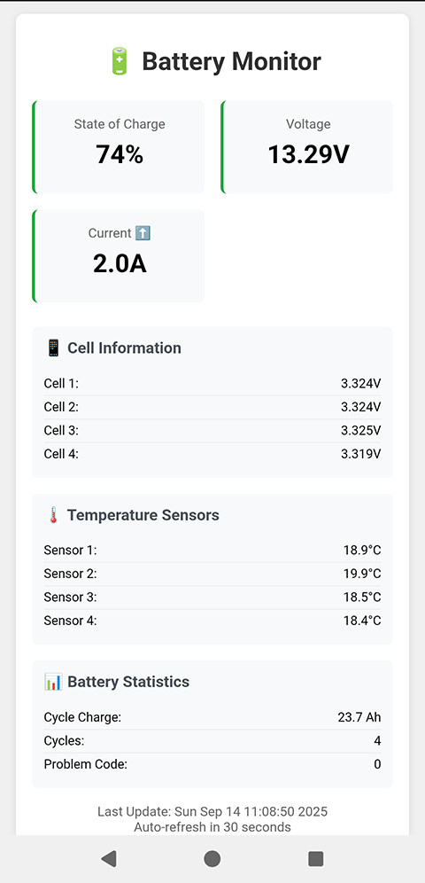

# BlueFiGate - WattCycle Battery BMS Bridge

A small Bluetooth-to-WiFi bridge for WattCycle Smart Batteries that provides web-based monitoring and secures your battery against unauthorized access.

## Overview

BlueFiGate connects to WattCycle Smart Batteries via Bluetooth and exposes battery information through a local web interface. It runs on ESP32 microcontrollers and provides real-time battery data.

## Key Features

### Web Interface
- **Local Web Dashboard**: Access battery data at `http://bluefigate.local`
- **JSON API**: Get raw data from `http://bluefigate.local/battery.json`
- **No App Required**: Works with any browser on your WiFi network

### Security Protection
WattCycle batteries don't (yet) support BMS passwords, leaving them vulnerable to unauthorized access, meaning anyone nearby can turn off your battery or change critical parameters. BlueFiGate solves this by:
- Maintaining a persistent Bluetooth connection to your battery
- Preventing discovery by other devices (BMS stops advertising when connected and will not accept additional connections)

## Hardware Requirements

- **Primary**: ESP32 C3 SuperMini Plus
- **Compatible**: Any ESP32 variant (may require minor code adaptations)
- **Tested With**: WattCycle 12V 314Ah Smart Battery

## Status LED Indicators

| Color | Meaning |
|-------|---------|
| Yellow | Connecting to WiFi and Battery |
| Green | Connected successfully (turns off after few minutes to save power) |
| Red | Connection temporarily lost |
| Bright Red | Device crashed on last boot |

## Installation

### Prerequisites
- [VSCode](https://code.visualstudio.com/)
- [PlatformIO Extension](https://platformio.org/install/ide?install=vscode)

### Setup Steps

1. **Clone the repository**
2. **Configure WiFi credentials**
Edit `config.h` with your WiFi network details

3. **Build and upload**
- Open project in VSCode with PlatformIO
- Connect your ESP32 via USB
- Click "Upload" in PlatformIO toolbar

4. **Access the interface**
- Connect to `http://bluefigate.local` in your browser
- Or use the JSON endpoint: `http://bluefigate.local/battery.json`

## Web Interface

The web interface displays real-time battery information including charge level, voltage, current, and other BMS parameters.

## Use Cases

- **Van Life**: Monitor your battery without relying on manufacturer apps
- **Security**: Prevent unauthorized access
- **Integration**: JSON API allows integration with other home automation apps

## Configuration

Edit `config.h` to set:
- WiFi network credentials
- Battery MAC Address (can be seen in the app)

## Disclaimer

This project provides practical security against casual interference but is not military-grade protection. Determined attackers with sufficient resources can find ways around (jamming, race conditions etc).